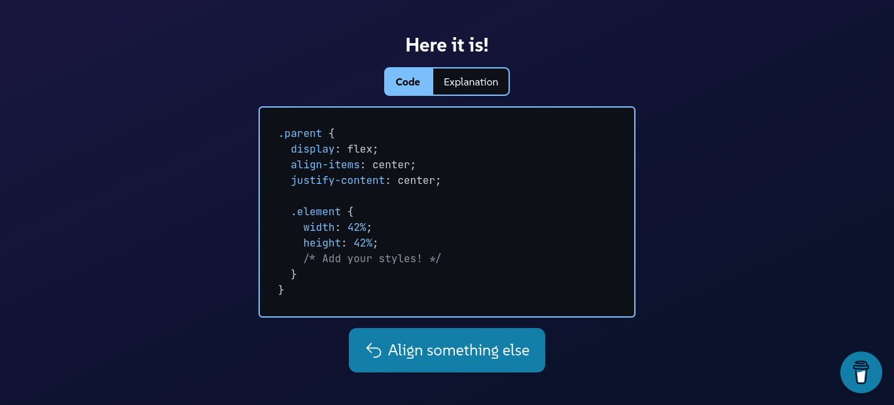

# CSS Aligner <a href="https://cssaligner.vercel.app"></a>

**Never forget how to center your `div` again.** 
This tool helps developers with CSS alignment in a dynamic, interactive and fluid way.

## Table of Contents
- [CSS Aligner ](#css-aligner-)
  - [Table of Contents](#table-of-contents)
  - [Technologies](#technologies)
  - [Installation](#installation)
  - [Author](#author)



## Technologies
This project is built with:
- [Vue.js](https://vuejs.org): my preferred front-end framework (and the one I have stronger skills), being very intuitive and enabling the creation of the front-end with ease, also with easy integration with Tailwind and TypeScript.
- [Tailwind CSS](https://tailwindcss.com): to accelerate the development and ensure a consistent design, and its `@apply` at-rule works seamlessly with Vue's single file components.
- [TypeScript](https://www.typescriptlang.org/): to ensure a safe and documented JS code, also with great IDE support.

## Installation
Be sure to have [Node.js](https://nodejs.org) installed.
```bash
# Clone the repository
$ git clone https://github.com/luizhf42/css-aligner

# Access the directory
$ cd css-aligner

# Install the dependencies
$ npm install

# Run! ─ the server will start at http://localhost:3000
$ npm run dev
```

## Author
Made by [Luiz Henrique](https://linkedin.com/in/luizhf42) 🐢